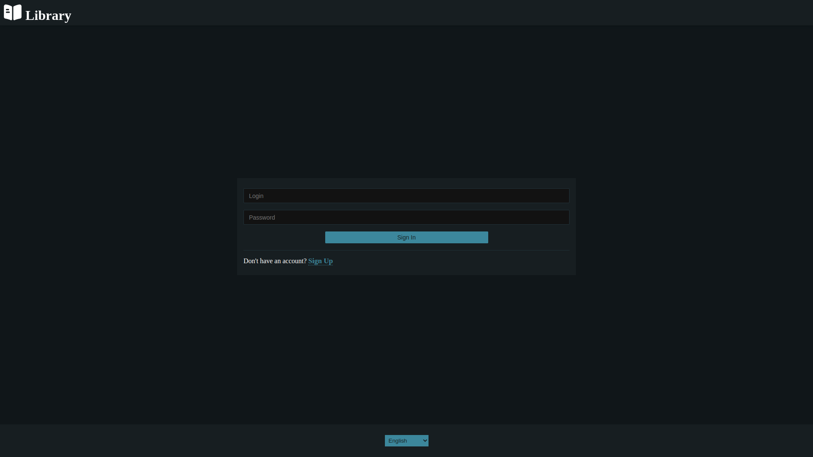
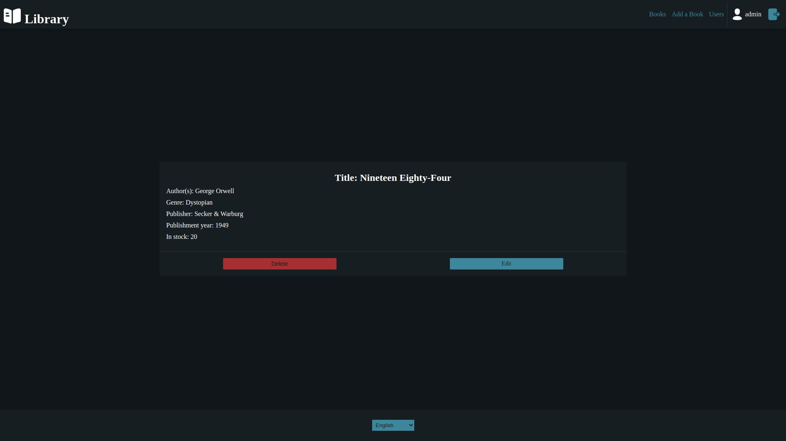
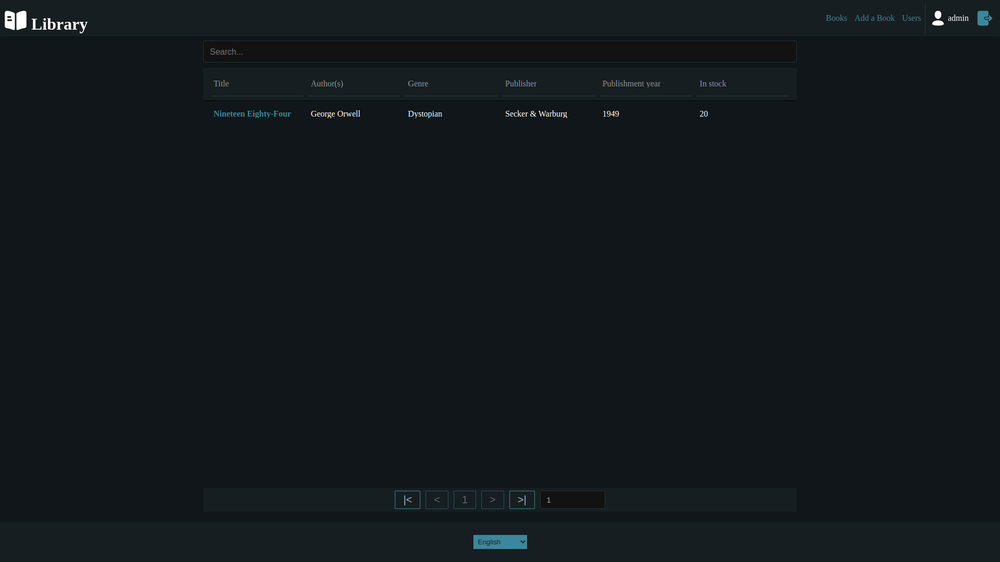
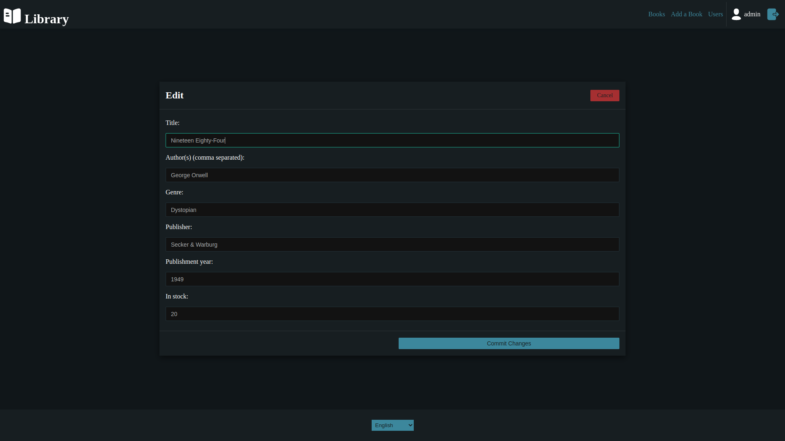

# library-react

    
    

## About

A front-end application for the library-spring project, built with React JS.

## Installation

1. Download and unzip the source code
2. Specify the `REACT_APP_API_URL` in the [.env](/.env) file with the URL of the deployed [library-spring](https://github.com/SirJohanot/library-spring) API (if left unspecified, the app will assume the following url: `http://localhost:8080`)
3. Run `npm run build` to build the app
4. Run `serve -s build` to deploy the app

## Screenshots

## Requirements

- [Node.js](https://nodejs.org/en/)
- [Serve](https://www.npmjs.com/package/serve)

## Developers

- [Johanot](https://github.com/SirJohanot)
- [Aliaksandr](https://github.com/SashaMed)

## License

Project Library React is distributed under the MIT license.